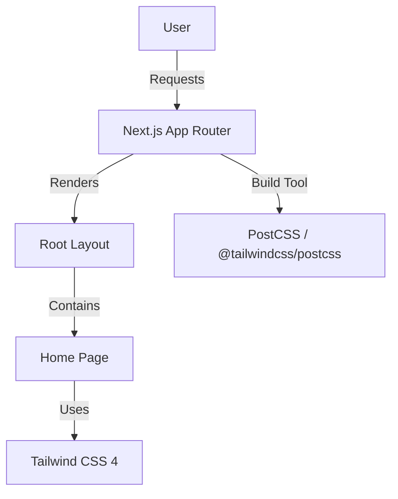

# AGENTS.md
This file provides guidance to Verdent when working with code in this repository.

## Table of Contents
1. Commonly Used Commands
2. High-Level Architecture & Structure
3. Key Rules & Constraints
4. Development Hints

## Commands
- **Dev Server**: `npm run dev`
- **Build**: `npm run build`
- **Lint**: `npm run lint`
- **Start**: `npm run start`
- **Single Test**: No test runner configured in `package.json` [inferred]

## Architecture
- **Major Subsystems**:
    - **Frontend**: Next.js 16 (App Router) using React 19.
    - **Styling**: Tailwind CSS 4 with `@tailwindcss/postcss`.
- **Key Data Flows**:
    - Request processing via Next.js App Router conventions.
    - Server-side rendering (SSR) by default for files in `app/`.
- **External Dependencies**:
    - Next.js 16.1.6
    - React 19.2.3
    - Tailwind CSS 4
- **Development Entry Points**:
    - `app/layout.tsx`: Root layout, global styles (`globals.css`), and font configuration.
    - `app/page.tsx`: The main landing page.
- **Subsystem Relationships**:

## Key Rules & Constraints
- **Framework**: Use Next.js 16 App Router patterns. Avoid the `pages/` directory unless specifically requested [inferred].
- **Styling**: Use Tailwind CSS 4 utility classes. Prefer inline classes over custom CSS in `globals.css` where possible.
- **TypeScript**: All new code must be written in TypeScript (`.ts`, `.tsx`).
- **ESLint**: Adhere to the configuration in `eslint.config.mjs`.

## Development Hints
- **Adding a new Page**: Create a new folder in `app/` with a `page.tsx` file (e.g., `app/about/page.tsx`).
- **Modifying Global Styles**: Update `app/globals.css`.
- **Environment Variables**: Add to `.env.local` (ensure it is gitignored).
- **Extending Architecture**: Follow the standard Next.js 16 conventions for Server Components vs. Client Components. Use `'use client'` directive only when necessary for interactivity or browser APIs.
