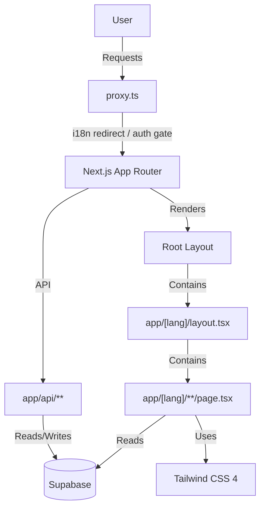

# AGENTS.md
This file provides guidance to Verdent (and other AI coding agents) when working with code in this repository.

> **The source of truth for project rules is [`CLAUDE.md`](CLAUDE.md)** (verification order, DB/RLS rules, i18n rules, branch strategy).
> Architecture patterns: [`docs/ARCHITECTURE.md`](docs/ARCHITECTURE.md) · data layer: [`docs/DATA_LAYER.md`](docs/DATA_LAYER.md).
> This file is only a short pointer — when in doubt, follow CLAUDE.md.

## Table of Contents
1. Commonly Used Commands
2. High-Level Architecture & Structure
3. Key Rules & Constraints
4. Development Hints

## Commands
- **Dev Server**: `npm run dev` (do not click-test in the browser on the dev server — use `npm run start` / Playwright; see CLAUDE.md)
- **Build**: `npm run build`
- **Lint**: `npm run lint` (CI runs it with `--max-warnings=0`)
- **Type check**: `npx tsc --noEmit`
- **Start**: `npm run start`
- **Unit tests**: `npm test` (= `vitest run`, `lib/**/__tests__/*.test.ts`)
- **E2E tests**: `npx playwright test` (builds + starts a production server automatically; single spec: `npx playwright test e2e/<name>.spec.ts --reporter=list`). Kill port 3000 before a fresh run (CLAUDE.md).
- **Guardrail scans**: `npm run scan` (god-file line counts + fragility patterns)

## Architecture
- **Major Subsystems**:
    - **Frontend**: Next.js 16 (App Router) + React 19, path-based i18n — every page lives under `app/[lang]/` (8 locales: ko, en, ja, zh, es, fr, de, it).
    - **Middleware**: `proxy.ts` (Next 16 convention, not `middleware.ts`) — language redirect, AI-crawler 403, Supabase session refresh, protected/admin routes, onboarding gate.
    - **Backend/Data**: Supabase (Postgres + Auth + Storage) via `@supabase/ssr` / `@supabase/supabase-js`; API routes in `app/api/**`; server reads in `lib/queries/`. Schema changes go through `supabase/migrations/`.
    - **Styling**: Tailwind CSS 4 with `@tailwindcss/postcss`.
    - **Other**: Sentry (lazy-loaded from `instrumentation-client.ts`, consent-gated), web-push, Resend (email), maplibre-gl (delivery map, unreleased).
- **External Dependencies** (see `package.json` for exact ranges):
    - Next.js 16.2.x (lockfile: 16.2.6)
    - React 19.2.3
    - Tailwind CSS 4
    - Testing: Vitest (unit) + Playwright (E2E)
- **Development Entry Points**:
    - `app/layout.tsx`: Root layout, global styles (`globals.css`), font (Geist via `next/font`).
    - `app/[lang]/layout.tsx`: Locale shell (theme · i18n · auth · toast · cookie-consent · accessibility providers).
    - `app/[lang]/page.tsx` + `app/[lang]/HomeClient.tsx`: Home page (fridge UI).
    - `proxy.ts`: Request middleware.
- **Subsystem Relationships**:

```mermaid
graph TD
    User -->|Requests| Proxy[proxy.ts]
    Proxy -->|i18n redirect / auth gate| NextJS[Next.js App Router]
    NextJS -->|Renders| Layout[Root Layout]
    Layout -->|Contains| LangLayout["app/[lang]/layout.tsx"]
    LangLayout -->|Contains| Page["app/[lang]/**/page.tsx"]
    Page -->|Reads| Supabase[(Supabase)]
    NextJS -->|API| Api["app/api/**"]
    Api -->|Reads/Writes| Supabase
    Page -->|Uses| Tailwind[Tailwind CSS 4]
```

## Key Rules & Constraints
- **Framework**: Use Next.js 16 App Router patterns. Avoid the `pages/` directory.
- **Verification order** (CLAUDE.md): lint → scan → build → unit tests → Playwright E2E.
- **i18n**: No hardcoded user-facing Korean strings in components — use `t.<namespace>.<key>` and add new keys to all 8 locale files.
- **Links/navigation**: use `LocalizedLink` / `useLocalizedRouter` (keeps the `/[lang]` prefix).
- **Styling**: Use Tailwind CSS 4 utility classes. Prefer inline classes over custom CSS in `globals.css` where possible.
- **TypeScript**: All new code must be written in TypeScript (`.ts`, `.tsx`).
- **ESLint**: Adhere to the configuration in `eslint.config.mjs`.

## Development Hints
- **Adding a new Page**: Create `app/[lang]/<route>/page.tsx` (e.g., `app/[lang]/about/page.tsx`). A page created directly under `app/` (without `[lang]`) is unreachable — `proxy.ts` redirects `/about` to `/{lang}/about`.
- **Modifying Global Styles**: Update `app/globals.css`.
- **Environment Variables**: Copy `env.example` to `.env.local` (gitignored) and fill in the values.
- **Extending Architecture**: Follow the standard Next.js 16 conventions for Server Components vs. Client Components. Use `'use client'` directive only when necessary for interactivity or browser APIs.
